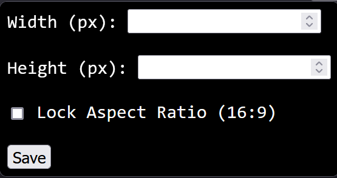

# YTABBB
Firefox extension that on youtube page load or navigation replaces player with embedded iframe of the video

Basically, it uses an observer to watch for changes to the page on youtube.com, then if a change occurs it checks if the player is visible, if it is it replaces it with an embedded iframe of the video.

## This can be useful for reasons like:
* Maybe you have a problem that is causing the player to lock and you can't watch the video (for some reason)
* Maybe youtube stopped working some time in the summer of 2023 and you need to use the embedded player to watch videos (for some reason, who knows why?) 

## How to install
1. Goto about:addons in firefox (or click on the hamburger menu and click on addons)
2. Click on the gear icon and click on "Install Add-on From File..."
3. Select the YTABBB-Signed.xpi file
4. Click on "Add" in the popup
5. Choose to allow the extension to run in private windows or not (if no, private windows will not run the embedded player)
6. Done! You can now close the tab and go to youtube.com and see the embedded player

## How to change the default player size
1. Click on the Youtube Ad Blocker Blocker Blocker (YTABBB) extension icon in the top right of the browser 
    * If not seen, Click on the Extensions Puzzle Piece icon in the top right of the browser to see all extensions

<!--  -->

    </img>

2. Type in the width and height you want the player to be then click "Save"
3. Optionally you can click on the lock aspect ratio checkbox to lock the aspect ratio of the player to 16:9 (note this only scales based on the width)
4. Done! You can now close the tab and go to youtube.com and see the embedded player

## How to uninstall
1. Goto about:addons in firefox (or click on the hamburger menu and click on addons)
2. Scroll down to the Youtube Ad Blocker Blocker Blocker (YTABBB) extension
3. Click on the 3 dots and click on "Remove"
4. Done! You can now close the tab and go to youtube.com and see the normal player

## Files in this repo:
### YTABBB Folder
* See the [manifest.json](/YTABBB/manifest.json) file for more info on the permissions.
* See the [content.js](/YTABBB/content.js) file for more info on the base code (this is where the replacement code is as well as the observer).
* See the [background.js](/YTABBB/background.js) file for more info on the code that runs in the background. (this mainly is used to check for page refreshes)
* See the [popup.js](/YTABBB/popup.js) file for more info on the code that runs when the extension icon is clicked. (this is where the settings are saved and loaded from)
* See the [popup.html](/YTABBB/popup.html) file for more info on the html that is used for the popup settings page.
* See the [/icons](/YTABBB/icons/) folder for the AI generated icons at 4 different sizes (16x16, 48x48, 128x128, 700x700)
### YTABBB-Signed.xpi
* This is the signed extension file that can be installed in firefox
* This file will be updated with each release, no promises on how often that will be though, hopefully this extension will become obsolete for good reasons soon.
### README.md
* This file, the one you are reading right now
### images folder
* This folder contains the images used in this README.md file
* The images are not used in the extension, they are just here for the README.md file